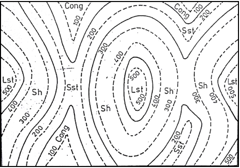
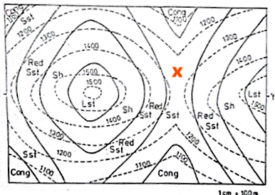
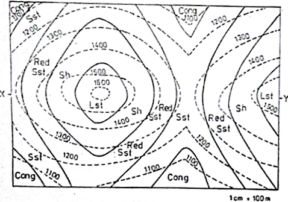

## <b> Pre-test </b>
#### Please attempt the following questions

Q 1. Based on the fact that “Higher the elevation of rock Younger will be the rock and vice versa”. Tell which among the following is the youngest rock and the oldest rock from the given contour map. The rocks are Limestone, Shale, Conglomerate, Sandstone 
       
<b>a. Youngest: Limestone, Oldest: Conglomerate</b> 
b. Youngest: Shale, Oldest: Conglomerate 
c. Youngest: Limestone, Oldest: Sandstone 
d. Youngest: Sandstone, Oldest: Conglomerate  

Q 2. Which of the following statement is/are true regarding the following contour map 
       
a. Each of the rock beds are inclined with horizontal at angle of 32.15&deg; 
<b>b. Each of the rock beds are parallel to horizontal surface i.e Angle of Dip = 0&deg;</b> 
c. Thickness of Shale bed rock is less than 100 m at each and every point of the contour map 
d. None of the above  

Q 3. What is the possible index of the point “X” shown in the contour map below? 
       
a. 1150 
<b>b. 1250</b> 
c. 1350 
d. 1450  

Q 4. What is the highest index of the contour lines in the map shown below? 
       
a. 1300 
b. 1400 
<b>c. 1600</b> 
d. 1500  

Q 5. What can be said about the profile represented by the below contour map? 
       
a. It represents a flat region 
<b>b. It represents a hill followed by a valley and then again hill</b> 
c. It represents a valley followed by a hill and again a valley 
d. None of the above  
