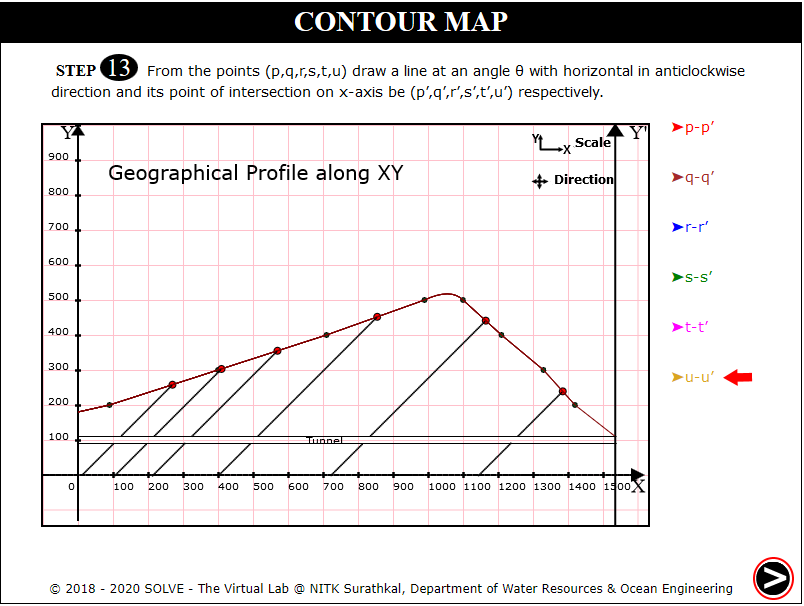

### These procedure steps will be followed on the simulator

#### Contour Map 1

1. When you click on a Contour Map 1 file, a new window will open, Click on Next button at the bottom right corner to move to the next step. 
 

2. Click on the rectangular box to identify the section along profile is considered. Click Next. 
 

3. Click on Get paper and Mark Points to mark dotted lines intersecting the profile. Click Next. 
 

4. Click on Plot X Axis, Plot Y Axis, Points on X Axis, Points on Y Axis to plot axis of the graph. Click Next. 
 

5. Click on each point to plot points a, b.....h to plot on the graph. Click Next. 
 

6. Click on Plot Y' X:1535 Y:0 to draw perpendicular line at Y=1535. Click Next. 
 

7. Click on Get paper and Mark Points to mark solid lines intersecting the profile. Click Next. 
 

8. Click on Define X Coordinates and name the points p, q, r.. taking its distance from X as x Coordinate. Click Next. 
 

9. Read the instructions to calculate the index of solid lines. Click Next. 
 

10. Click on calculate the index of each solid line by selecting appropriate M and N value. 
 

11. Click on each point to plot points p, q.....u to plot on the graph. Click Next. 
 

12. Click to join points to connect all the points on the graph, Click Next. 
 

13. Click on Draw Tunnel to locate the tunnel on the graph, Click Next. 
 

14. Click on to calculate angle of dip at points where solid lines intersect dotted lines. Click Next. 
 

15. Draw lines at angle of dip from point p to u intersecting the X axis Click Next. 
 

16. Click on each stone type to see the distribution and answer the question displayed, click Next. 
 

17. Click on each stone type and note the vertical thickness of the bed in that region, click Next. 
 

18. Click on each label button to see the different graph. 
 

#### Contour Map 2

1. When you click on a Contour Map 2 file, a new window will open, Click on Next button at the bottom right corner to move to the next step. 
 

2. Click on the rectangular box to identify the section along profile is considered. Click Next. 
 

3. Click on Get paper and Mark Points to mark dotted lines intersecting the profile. Click Next. 
 

4. Click on Plot X Axis, Plot Y Axis, Points on X Axis, Points on Y Axis to plot axis of the graph. Click Next. 
 

5. Click on Define Coordinate and click on each point to plot points a, b.....k to plot on the graph. 
 

6. Click on Plot Y' X:1535 Y:0 to draw perpendicular line at Y=1535. Click Next. 
 

7. Click on Get paper and Mark Points to mark solid lines intersecting the profile. Click Next. 
 

8. Click on Define X Coordinates and name the points p, q, r.. taking its distance from X as x Coordinate. Click Next. 
 

9. Click on If Found/ If Not Found based on whether first line is a dotted line on both sides. Click Next. 
 

10. Click on calculate the index of each solid line by selecting appropriate M and N value. 
 

11. Click on each point to plot points p, q.....x to plot on the graph. Click Next. 
 

12. Click to join points to connect all the points on the graph, Click Next. 
 

13. View the formula to calculate angle of dip at points where the solid lines intersect the dotted lines, Click Next. 
 

14. Click on to calculate angle of dip by clicking on each point. Click Next. 
 

15. Draw lines at angle of dip from point p to u intersecting the X axis Click Next. 
 

16. Click on each stone type to see the distribution, click Next. 
 

17. Click on to find the true thickness and vertical thickness in different region, click Next. 
 

18. Click on each label button to see the different graph. 
 
