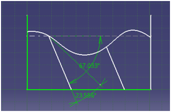

## Post test
Q 1. Two dimensional profile of a geological structure is shown 
 
Determine the angle of dip 
<b>a. 67.033&deg; to south</b> 
b. 23.556&deg; to south 
c. Irrespective of profile it always remains 0&deg; to south 
d. Irrespective of profile it always remains 90&deg; to south  

Q 2. If the contour lines are at very large distance to each other, this indicates a ________slope 
a. Steep 
<b>b. Gentle</b> 
c. No significant 
d. None of the above  

Q 3. The distance measured perpendicular to the upper and lower contact of a tabular unit 
a. Outcrop width 
<b>b. True thickness</b> 
c. Apparent thickness 
d. None of the above  

Q 4. The distance on the map between the bounding contacts of a tabular unit measured along an azimuth perpendicular to strike 
a. Outcrop width 
<b>b. True thickness</b> 
c. Apparent thickness 
d. None of the above  

Q 5. Geologic graphics help determination of the geology of an area comprising of the rock formations, their thickness and sequence above or below the ground surface. (Say True or False) 
a. True 
<b>b. False</b>  
