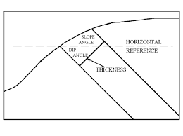

### INTRODUCTION 

A topographic map is a two-dimensional representation of a portion of the three-dimensional surface of the earth. A topographic profile of the earth surface is obtained from topographic profiling. Topographic Profile is a cross-sectional view along a line drawn through a portion of a topographic map. Topographic map alone provides details of underground features such as dip, strike, thickness of the rock formations etc, which will be useful for many practical analysis.

Geologic graphics is the computation of dip, strike and other measurable structural parameters of rock masses by geometrical methods from the topographic map. Geologic graphics help determination of the geology of an area comprising of the rock formations, their two dimensional configuration, thickness and sequence at or below the ground surface which are the most important geological data for planning and execution of earth works like cuttings, quarrying, underground works and improvement of site conditions, design, construction and maintenance of complex, costly and vital engineering structures.

In rock structure, mainly one can analyse dip, strike and thickness of the strata as explained below:

1. <strong>Dip</strong>: it is the angle of inclination of a rock bed with the horizontal plane. The inclination of rock strata from the horizontal is specified by,

<ol style="text-indent:50px;text-align:justify;list-style-position: inside;">
<li>The amount of inclination is expressed as gradient like 1 in 5, 1 in 10 etc., more commonly in degree and minutes.</li>
<li>The direction of inclination is expressed full circle bearing like N 150&deg; or more commonly quadrants bearings like N 15&deg; W.</li>
<li>True Dip (TD): It is the measure at right angle to the strike.</li>
<li>Apparent Dip (AD): If the angle is measured in any other direction than the true dip direction.</li>
</ol>

  

Dip and Strike of Rock Bed
 

Source: (<a href="https://geology.fandom.com/wiki/Strike_and_dip">https://geology.fandom.com/wiki/Strike_and_dip</a>)

2. <strong>Strike</strong>: It is the direction of line formed by the intersection of the bedding plane with the horizontal plane. The strike is always at right angle to the true dip. It is stated as N 30&deg; W-S 30&deg; W, S 15&deg; W- N 15&deg; W.

3. <strong>Thickness of Strata</strong>

<ol style="text-indent:50px;text-align:justify;list-style-position: inside;list-style-type: lower-alpha">
<li><strong>True Thickness</strong>: Distance measured perpendicular to the upper and lower contact of a tabular unit.</li>
<li><strong>Apparent Thickness</strong>: Vertical distance between an upper and lower contact in a nonhorizontal unit. The apparent thickness is equal to the true thickness only when the altitude of the unit is horizontal.</li>
<li><strong>Outcrop Width</strong>: Distance on the map between the bounding contacts of a tabular unit measured along an azimuth perpendicular to strike.</li>
<li><strong>Apparent Width</strong>: Distance on the map between the upper and lower contacts of a tabular unit measured in a direction other than perpendicular to strike.</li>

  

Section of Rock Strata
 

Source: (<a href="https://www.southalabama.edu/geography/allison/GY403/LABMAN_chapt7.pdf">https://www.southalabama.edu/geography/allison/GY403/LABMAN_chapt7.pdf</a>)

